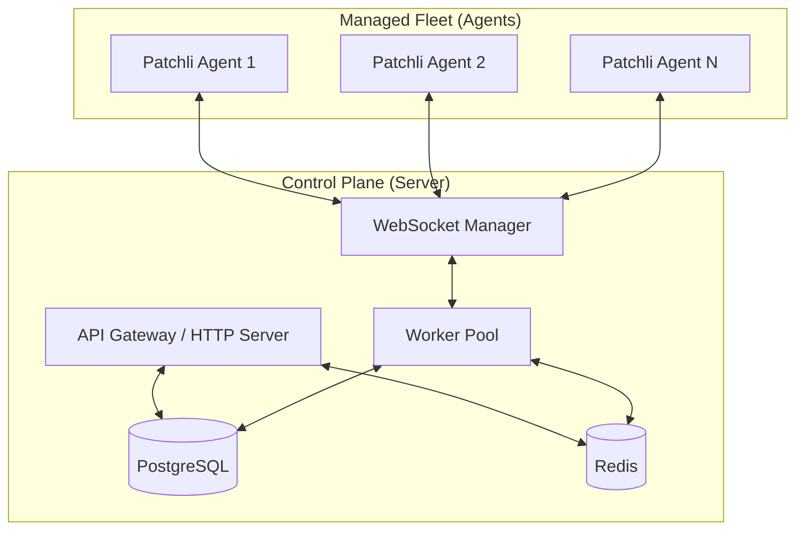
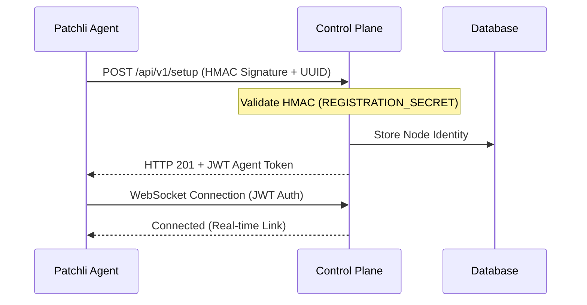

#  Patchli

### Distributed Linux Patch Management & Fleet Monitoring System

Patchli is a high-performance, distributed Patch Management system designed to seamlessly orchestrate updates across massive fleets of Linux and Windows nodes. It provides a centralized Control Plane for monitoring, scheduling, and executing updates with a focus on reliability, security, and real-time observability.

---

## 🏗️ Architecture

Patchli follows a robust client-server architecture. The **Control Plane** manages the fleet state and orchestrates jobs, while lightweight **Agents** execute tasks locally on each node.



---

## 🔐 Zero-Touch Registration

Agents register themselves securely using an HMAC-signed setup script. Once registered, they receive a persistent JWT for all future communications.



---

## ✨ Key Features

- **🚀 Performance**: Go-based architecture with gRPC-ready design and non-blocking worker pools.
- **🛡️ Resilience**: Self-healing watchdog, HTTP long-polling fallback, and state recovery after reboots.
- **📦 Multi-OS Support**: Native support for **APT** (Debian/Ubuntu), **APK** (Alpine), **DNF/YUM** (RHEL/Rocky), **Pacman** (Arch), **Zypper** (SUSE), and **WUA** (Windows).
- **🔒 Security**: HMAC-based zero-touch registration, JWT persistent authentication, and pre-patch lock checks.
- **🛠️ Orchestration**: Maintenance windows, pre/post-patch scripts, and remote health checks.
- **📈 Observability**: Real-time log streaming via WebSockets and detailed fleet metrics.

---

## ⚙️ Configuration Reference

### Control Plane (Server)

| Variable | Description | Default | Required |
| :--- | :--- | :--- | :--- |
| `DB_URL` | PostgreSQL connection string (`postgres://...`) | - | **Yes** |
| `REDIS_URL` | Redis connection string (`redis:6379`) | - | **Yes** |
| `PORT` | Listening port for the API and Dashboard | `8080` | No |
| `JWT_SECRET` | Secret key for signing Agent authentication tokens | - | **Yes** |
| `REGISTRATION_SECRET` | Secret key for generating HMAC setup signatures | - | **Yes** |
| `BASE_URL` | External URL of the server (e.g., `https://patch.example.com`) | `http://localhost:8080` | No |

### Intelligent Agent

| Flag | Description |
| :--- | :--- |
| `--verify` | Performs self-diagnosis (identity, PM detection, network) and exits. |

| Variable | Description | Default |
| :--- | :--- | :--- |
| `SERVER_URL` | Host and port of the Patchli Control Plane | `localhost:8080` |
| `TRUSTED_PUB_KEY` | Ed25519 public key (Base64) to verify downloaded binaries during self-update | - |

---

## 🚀 Getting Started

### 1. Deploy the Control Plane
The easiest way to start is using Docker Compose:

```bash
docker-compose up -d
```

### 2. Access the Dashboard
Navigate to `http://localhost:8080/` and log in.

### 3. Add Your First Agent
1. Go to the **Add Agent** section.
2. Select your OS (Linux, Alpine, or Windows).
3. Copy the generated one-liner and run it on your target node.
4. The node will appear in the dashboard automatically.

---

## 🛠️ Development

### Local Setup
```bash
# Run server
cd server && go run ./cmd/patchli-server/main.go

# Run agent
cd agent && go run ./cmd/patchli-agent/main.go
```

### Testing & Quality
We maintain a strict quality standard with **80% code coverage** enforcement.

```bash
# Run all tests
go test ./... -cover

# Run security scan
gosec ./...
```

---

## 📄 License
Patchli is released under the [MIT License](LICENSE).
```bash
# Run all tests
go test ./... -cover

# Run security scan
gosec ./...
```

---

## 📄 License
Patchli is released under the [MIT License](LICENSE).
